# BenefitOS System Architecture

## Current Architecture

BenefitOS is an Expo React Native mobile application backed by a Node.js/Express API and Neo4j graph database. The current v25 codebase is the production foundation. The frontend owns presentation, navigation, session restoration, local upload UX, and API calls. The backend owns authentication, Neo4j graph queries, OCR/document validation, welfare calculations, notifications, workflow orchestration, and Sarvam assistant relay logic.

### Frontend

The app root is `App.tsx`, which wraps the application in:

- `GestureHandlerRootView`
- `SafeAreaProvider`
- React Navigation `NavigationContainer`
- `RootNavigator`

`RootNavigator` is the stable navigation boundary. It restores auth state from `expo-secure-store`, renders login/signup when unauthenticated, and renders bottom tabs when authenticated. The main tabs are:

- `HomeScreen`
- `RoadmapScreen`
- `AssistantScreen`
- `ProfileScreen`

The stable screens that must remain protected are:

- `HomeScreen`
- `RoadmapScreen`
- `RootNavigator`
- Navigation lifecycle and focus behavior
- Existing React lifecycle and rendering behavior
- Zustand store architecture
- API scheduling patterns

Frontend data access is centralized through `src/lib/api/client.ts`, an Axios wrapper that:

- Requires `EXPO_PUBLIC_API_BASE_URL`.
- Attaches JWT bearer tokens from `useAuthStore`.
- Logs out on `401`.
- Caches successful `GET` responses in `AsyncStorage`.
- Marks offline status through `useNetworkStore`.

Feature-specific API wrappers live under `src/lib/api/services/`.

State is split across small Zustand stores:

- `authStore`: user, token, login state, secure persistence.
- `networkStore`: offline indicator.
- `appStore`: theme/sidebar/onboarding state.
- `welfareStore`: welfare score and missed schemes.
- `roadmapStore`: roadmap phases.

Screen-level hooks fetch and hold remote state:

- `useWelfareScore`
- `useMissedBenefits`
- `useRoadmap`
- `useCitizenProfile`

The profile area uses one stable `ProfileScreen` shell and local `activeScreen` state for sub-screens:

- Account settings
- Notifications
- Documents
- Privacy/security
- Graph visualizer
- Help/support
- About

### Backend

The backend entrypoint is `benefitos-backend/server.js`, which loads environment variables, validates the Neo4j connection, starts Express, and handles graceful shutdown.

`benefitos-backend/src/app.js` wires the application:

- CORS
- JSON parsing
- Intelligence routes
- Workflow routes
- Auth routes
- Notification routes
- `/health`
- Global error handler

The backend follows a mostly layered structure:

- Routes define HTTP paths and middleware.
- Controllers adapt HTTP requests into service calls.
- Services coordinate domain workflows.
- Query modules own Cypher statements.
- `config/db.js` owns Neo4j driver access, integer conversion, health checks, and transient retry behavior.

### Authentication

Authentication uses email/password with bcrypt hashes and JWT access tokens.

Key backend modules:

- `authRoutes.js`
- `authController.js`
- `authMiddleware.js`
- `citizenQueries.js`

The mobile app stores token and user data in `expo-secure-store`. Backend protected routes use `authMiddleware`; citizen-specific routes also use `authorizeCitizen` to prevent cross-citizen access.

### Neo4j

Neo4j is the single persistence layer. The graph includes:

- `Citizen`
- `Scheme`
- `Document`
- `LifeStage`
- `Family`
- `State`
- `Notification`

Important relationships include:

- `CURRENT_STAGE`
- `RESIDES_IN`
- `HAS_DOCUMENT`
- `ELIGIBLE_FOR`
- `RECOMMENDED_SCHEME`
- `BENEFITTING_FROM`
- `REQUIRES_DOCUMENT`
- `TARGETS_STAGE`
- `AVAILABLE_IN`
- `LEADS_TO`
- `BELONGS_TO`
- `HAS_NOTIFICATION`

Schema hardening lives in:

- `benefitos-backend/database/constraints.cypher`
- `benefitos-backend/database/indexes.cypher`

### OCR

The OCR path is split across frontend and backend.

Frontend document capture/upload lives in `MyDocumentsScreen`:

- Camera capture via `expo-camera`.
- Gallery selection via `expo-image-picker`.
- Offline crop/compression via `expo-image-manipulator`.
- File upload via `expo-file-system`.
- Offline queue persisted in `AsyncStorage`.

Backend OCR lives in:

- `services/ocr/OCRProvider.js`
- `services/ocr/TesseractOCRProvider.js`
- `services/documentIntelligenceService.js`
- `citizenService.verifyDocumentWorkflow`
- `workflowController.verifyDocument`
- `workflowRoutes` document endpoints

The backend preprocessing pipeline performs image header validation, Jimp-based cropping, edge detection, corner detection, perspective warp, normalization, contrast adjustment, Tesseract OCR, confidence scoring, document classification, and validation.

Current document validation supports rules for Aadhaar, PAN, Income Certificate, Passport, Driving Licence, Birth Certificate, Domicile Certificate, Disability Certificate, Widow Certificate, and Farmer Certificate.

### Workflow

The current workflow entrypoint is `workflowService.runRecalculationWorkflowForCitizen`.

It:

- Reads missed benefits before recalculation.
- Recalculates eligibility.
- Refreshes roadmap relationships.
- Refreshes recommendation relationships.
- Reads missed benefits after recalculation.
- Creates notifications for newly eligible schemes.
- Checks document readiness.
- Creates missing-document notifications.

Document verification calls this workflow after a document passes validation and is saved to Neo4j.

### Assistant

The assistant path is backend-mediated so Sarvam credentials remain off-device.

Frontend:

- `AssistantScreen`
- `assistantService.ts`
- `sarvamService.ts`

Backend:

- `workflowController.handleAssistantStream`
- `workflowController.handleTranscribe`
- `workflowController.handleSynthesize`
- `assistantService.js`

The backend assistant service performs intent detection, Neo4j context retrieval, prompt construction, Sarvam chat completion, speech-to-text, text-to-speech, timeout handling, and retry behavior.

### Notifications

Notifications are stored in Neo4j and exposed through:

- `notificationRoutes.js`
- `notificationController.js`
- `notificationQueries.js`
- `notificationService.ts`
- `NotificationsScreen`

The workflow currently creates notifications for newly eligible schemes and missing documents.

### Roadmap

Roadmap data is derived from citizen life stage and graph relationships:

- Frontend: `RoadmapScreen`, `useRoadmap`, `roadmapService.ts`
- Backend: `roadmapService.js`, `roadmapQueries.js`

`RoadmapScreen` uses focus-driven refresh behavior and must remain stable.

### Readiness

Readiness is computed by `citizenQueries.getDocumentReadiness` and normalized by `citizenService.getDocumentReadiness`.

It currently derives required documents from eligible scheme requirements, with a fallback to all `Document` nodes when no scheme-specific requirements exist.

### Graph

Graph visualization data is exposed through `citizenService.getGraphVisual` and `citizenQueries.getGraphNodesAndRelationships`, then displayed in `GraphVisualizer`.

## Dependency Diagram

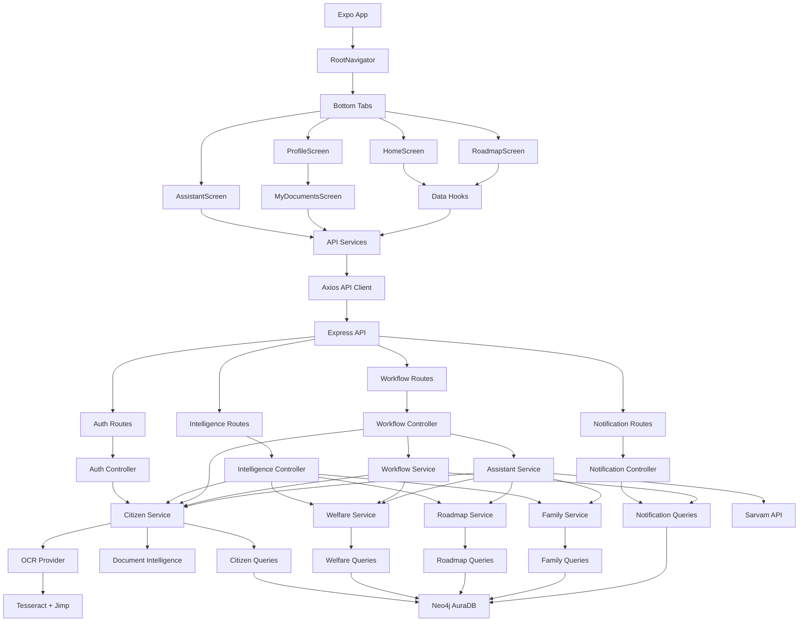

## Strengths

- Stable production baseline for Home, Roadmap, navigation, focus behavior, and rendering.
- Clear backend separation between routes, controllers, services, and query modules.
- Neo4j is consistently treated as the primary persistence layer.
- Auth middleware protects citizen-specific APIs from cross-citizen access.
- OCR pipeline is modular enough to replace the provider behind `OCRProvider`.
- Sarvam API keys are kept server-side.
- Backend tests cover major endpoints, auth flows, document verification, workflow, graph, notifications, assistant, and failure responses.
- Rate limiting exists for auth, graph, assistant, and profile/document workflows.
- Frontend API wrapper centralizes token attachment, logout on `401`, offline detection, and GET caching.
- Expo permissions are configured for camera and microphone use.

## Weaknesses

- Production responsibilities are mixed in several services. `citizenService` owns profile workflow, readiness, graph, OCR verification, and workflow triggering.
- Some business logic is duplicated or parallel across auth registration, profile update, document verification, login sync, and workflow recalculation.
- Readiness currently falls back to all `Document` nodes, which can make production behavior depend on global seed data instead of explicit citizen requirements.
- New user initialization is not yet modeled as a dedicated subsystem.
- `refreshToken` is a dummy value in auth responses.
- Rate limiting uses in-memory process state, which will not work consistently across multiple backend instances.
- Uploaded files and OCR debug files are written to local disk without a documented retention/cleanup policy.
- OCR debug artifacts are tracked in the repository, which blurs source code and runtime output.
- Error handling is centralized but coarse for production operations; most server errors become `Internal server error`.
- Logging uses `console.*` rather than structured logs with request IDs, citizen IDs, severity, and subsystem names.
- Tests mock Neo4j by query string matching, which is useful but brittle.
- Environment variables are documented, but frontend and backend env naming is not unified in one contract.
- README remains a generic Expo template and does not describe BenefitOS.

## Technical Debt

- Auth lifecycle debt:
  - No real refresh-token rotation.
  - JWT expiry config exists in `.env.example` but backend uses a hardcoded `"24h"` in signing.
  - Logout is stateless and does not revoke server-side sessions.

- Workflow debt:
  - Recalculation is triggered from multiple places.
  - Login and `getMe` perform graph recalculations, which couples session restoration to backend mutation.
  - Notification creation can duplicate messages because idempotency is not modeled.

- Data model debt:
  - Citizen stage exists as both a property and `CURRENT_STAGE` relationship.
  - Citizen state exists as both a property and `RESIDES_IN` relationship.
  - Document ownership, requirement, upload, verification, and readiness states are not fully separated.

- OCR debt:
  - Image preprocessing, debug output, and OCR execution live in one provider module.
  - Document rules are hardcoded inside `documentIntelligenceService`.
  - Field extraction is minimal and not document-specific enough for production verification.
  - OCR is English-only.

- Assistant debt:
  - Intent detection is keyword-based.
  - Prompt construction is embedded in the service instead of a reusable prompt builder.
  - Response validation is minimal.

- Frontend debt:
  - Several screens own data-fetching orchestration directly.
  - Offline behavior is partially implemented for GET cache and document queue, but not governed by a single sync engine.
  - Profile sub-navigation is local state rather than a typed nested navigator, though this should remain untouched while stable.

- Repository hygiene debt:
  - Runtime uploads and debug images are present in the working tree.
  - Documentation is scattered across reports and status files.

## Missing Production Components

- Central domain model documentation for Citizen, Document, Scheme, Workflow, Readiness, Notification, and Assistant context.
- Dedicated new-user initialization service.
- Explicit document requirement model with required/missing/not verified/verified states.
- Durable upload storage strategy.
- Upload cleanup and retention policy.
- Structured logging with correlation IDs.
- Metrics and tracing for API latency, OCR latency, Neo4j latency, Sarvam latency, rate-limit events, and workflow runs.
- Production-grade refresh-token/session management.
- Migration/versioning strategy for Neo4j constraints, indexes, and seed data.
- Idempotency strategy for workflow and notifications.
- Central error taxonomy for client-visible errors.
- CI pipeline that runs TypeScript, ESLint, Expo Doctor, and backend tests.
- Contract tests between frontend services and backend responses.
- Real OCR fixture suite with mock Aadhaar, PAN, Income Certificate, Passport, Driving Licence, and Ration Card.
- Secrets management policy for mobile and backend environments.
- API documentation.
- BenefitOS-specific README and onboarding runbook.

## Recommended Architecture

The recommended direction is to preserve the stable frontend shell and move production hardening into backend and domain modules first.

### Principles

- Preserve stable UI, navigation, lifecycle, focus logic, API scheduling, and Zustand behavior.
- Make backend services modular and independently testable.
- Treat Neo4j as the source of truth.
- Create one workflow orchestration path.
- Keep OCR, document workflow, assistant, readiness, and notification logic behind explicit interfaces.
- Make every mutation idempotent where practical.
- Use structured logs and meaningful error types.

### Proposed Backend Module Boundaries

- `AuthService`
  - Register, login, session validation, password change, token issuing.

- `CitizenService`
  - Read/update citizen profile only.

- `DocumentService`
  - Required document initialization.
  - Upload metadata.
  - Verification state transitions.
  - Readiness state.

- `OCRService`
  - Preprocess image.
  - Extract text.
  - Return confidence and diagnostics.

- `DocumentClassifier`
  - Classify document type.
  - Extract fields.
  - Validate document-specific requirements.

- `EligibilityService`
  - Recalculate eligibility and recommendation relationships.

- `RoadmapService`
  - Roadmap read model and relationship refresh.

- `WorkflowService`
  - The only orchestration entrypoint after citizen/profile/document mutations.

- `NotificationService`
  - Idempotent notification creation, reads, deletes.

- `AssistantService`
  - Intent detection.
  - Context retrieval.
  - Prompt building.
  - Sarvam client.
  - Response validation.

### Proposed Data Flow

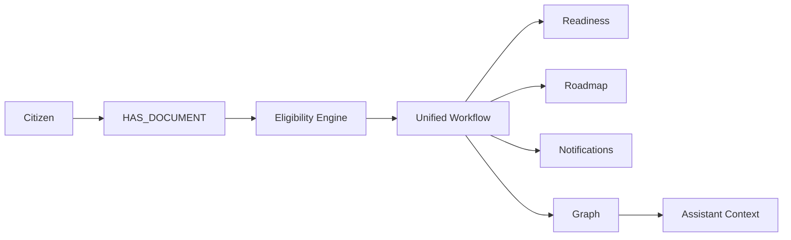

### Protected Frontend Strategy

Frontend improvements should be additive and isolated:

- Do not alter `HomeScreen`, `RoadmapScreen`, `RootNavigator`, focus logic, hook behavior, or Zustand architecture unless absolutely necessary.
- Keep API response shapes backward compatible.
- Prefer backend fixes that allow existing frontend code to continue working.
- If a frontend change is eventually required, isolate it behind a service function or document-specific screen path and verify no Home/Roadmap request loops.

## Implementation Roadmap

This roadmap respects the one-phase-per-run rule. Later phases should stop after their own deliverable and wait for review.

### Phase 1: System Architecture

Deliverable:

- `SYSTEM_ARCHITECTURE.md`

Status:

- Complete.

No code changes.

### Phase 2: OCR System

Goal:

- Design and implement a production-quality OCR subsystem without touching stable UI surfaces.

Recommended deliverables:

- `OCR_ARCHITECTURE.md`
- OCR fixture suite.
- OCR provider interface.
- Document preprocessing diagnostics that do not rely on tracked debug files.

### Phase 3: Document Workflow

Goal:

- Make document verification, Neo4j update, workflow trigger, readiness, roadmap, notifications, graph, and assistant context use one source of truth.

Recommended deliverables:

- `WORKFLOW_ARCHITECTURE.md`
- Document state model.
- Idempotent workflow tests.

### Phase 4: Sarvam Assistant

Goal:

- Productionize assistant architecture with prompt builder, response validation, context retrieval, graceful errors, timeouts, retries, and logging.

Recommended deliverables:

- `ASSISTANT_ARCHITECTURE.md`
- Assistant context contract.
- Sarvam client test harness.

### Phase 5: Unified Data Model

Goal:

- Normalize Citizen, Document, Scheme, Eligibility, Workflow, Roadmap, Notifications, Graph, and Assistant context around explicit graph relationships.

Recommended deliverables:

- Data model contract.
- Neo4j migration scripts.
- Contract tests.

### Phase 6: New User Initialization

Goal:

- Every new citizen receives Aadhaar Card, PAN Card, and Income Certificate as required, missing, and not verified.

Recommended deliverables:

- New user initialization service.
- Document requirement tests.
- No frontend rendering changes unless the existing documents/readiness APIs cannot represent the state.

### Phase 7: Testing

Goal:

- Ensure every subsystem has stable automated and manual verification.

Recommended deliverables:

- CI checklist.
- Backend integration tests.
- Frontend contract tests.
- OCR fixtures.
- Manual verification runbooks.

### Phase 8: Documentation

Goal:

- Maintain living architecture and subsystem documentation.

Recommended deliverables:

- Updated `SYSTEM_ARCHITECTURE.md`
- `OCR_ARCHITECTURE.md`
- `ASSISTANT_ARCHITECTURE.md`
- `WORKFLOW_ARCHITECTURE.md`
- Updated `PROJECT_STATUS.md`
- Updated `CHANGELOG.md`

---

# Detailed Engineering Handoff

This section expands the overview above into an engineer-facing operating manual. It is intended for a senior engineer joining BenefitOS who needs to understand where code lives, who owns each concern, how requests flow end to end, and where the current system is intentionally stable versus where future production work should happen.

## 1. System Overview

### Product Purpose

BenefitOS is a welfare-intelligence platform for citizens. Its purpose is to help a citizen understand their welfare eligibility, missing documents, roadmap opportunities, family-level benefit opportunities, notifications, and AI-guided next steps. The product is built around a graph-backed welfare model: citizens, life stages, documents, schemes, states, families, and notifications are linked in Neo4j so the app can derive eligibility and guidance from relationships rather than isolated tables.

### System Shape

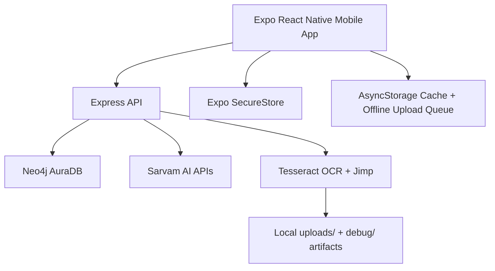

BenefitOS currently uses a single backend process with route-level rate limiting, JWT authentication, and direct Neo4j access through a shared query wrapper. The frontend is a single Expo app using React Navigation bottom tabs, Zustand stores, focused screen hooks, and Axios services.

### Major Subsystem Interaction

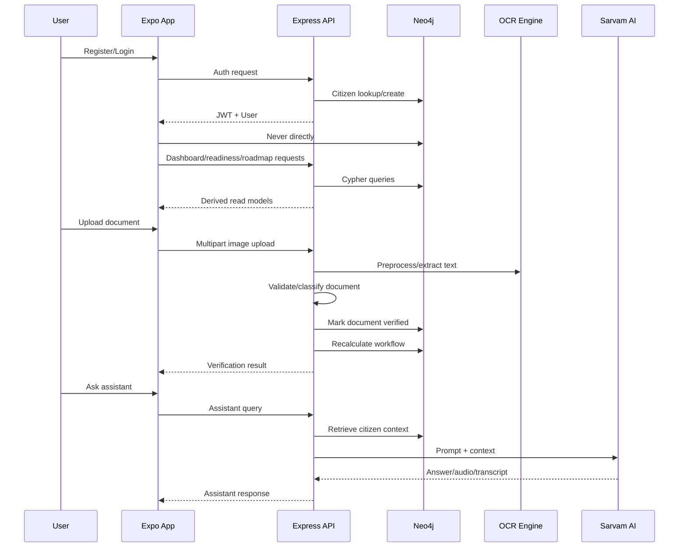

### Subsystem Responsibilities

| Subsystem | Primary Responsibility | Main Files | Source of Truth |
| --- | --- | --- | --- |
| Frontend shell | Stable app root, auth restoration, tab navigation | `App.tsx`, `src/navigation/RootNavigator.tsx` | React Navigation + Zustand auth state |
| Home | Dashboard summary, welfare score, missed benefits, readiness widgets | `src/screens/HomeScreen.tsx`, hooks, API services | Backend API responses from Neo4j |
| Roadmap | Current/next stage and opportunities | `src/screens/RoadmapScreen.tsx`, `useRoadmap` | Neo4j life-stage graph |
| Profile | Account, documents, notifications, graph entry points | `src/screens/ProfileScreen.tsx` and profile sub-screens | Mix of Zustand user + backend APIs |
| Authentication | Account creation, login, JWT validation | `authController.js`, `authMiddleware.js`, `authStore.ts` | Neo4j `Citizen` + SecureStore token |
| OCR | Image preprocessing, text extraction, confidence | `OCRProvider.js`, `TesseractOCRProvider.js` | Uploaded file + OCR result |
| Document intelligence | Document classification and validation | `documentIntelligenceService.js` | Validation rules + OCR text |
| Workflow engine | Eligibility, roadmap, recommendations, notifications | `workflowService.js`, `welfareService.js`, `roadmapService.js` | Neo4j graph relationships |
| Assistant | Citizen context retrieval and Sarvam interaction | `assistantService.js`, `AssistantScreen.tsx` | Neo4j context + Sarvam response |
| Notifications | User welfare notifications | `notificationQueries.js`, `NotificationsScreen.tsx` | Neo4j `Notification` nodes |

## 2. Project Structure

### Root

| Path | Purpose | Important Files | Dependencies | Logic Owner |
| --- | --- | --- | --- | --- |
| `/` | Expo app root and project configuration | `App.tsx`, `package.json`, `app.json`, `babel.config.js`, `metro.config.js`, `tsconfig.json` | Expo SDK 56, React 19, React Native 0.85 | Frontend platform owner |
| `assets/` | App icons, splash images, React/Expo images | `icon.png`, `adaptive-icon.png`, `splash-icon.png` | Expo asset pipeline | Frontend/platform |
| `ios/` | Native iOS generated project | native workspace files | Expo prebuild/native tooling | Mobile build owner |
| `.expo/` | Expo local state/cache | `README.md`, devices metadata | Expo CLI | Tooling only; not business logic |

### Frontend Source

| Path | Purpose | Important Files | Dependencies | Logic Owner |
| --- | --- | --- | --- | --- |
| `src/` | Mobile application source | all app modules | React Native, Expo | Frontend owner |
| `src/screens/` | Top-level screens rendered by navigation | `HomeScreen.tsx`, `RoadmapScreen.tsx`, `AssistantScreen.tsx`, `ProfileScreen.tsx`, `LoginScreen.tsx`, `SignUpScreen.tsx` | React Navigation, Zustand, API services | Screen owners; stable lifecycle protected |
| `src/screens/profile/` | Profile sub-screens rendered inside `ProfileScreen` | `MyDocumentsScreen.tsx`, `GraphVisualizer.tsx`, `NotificationsScreen.tsx`, account/privacy/help/about screens | Expo Camera/FileSystem, API services | Feature owners |
| `src/components/` | Reusable visual components | `WelfareScoreCard.tsx`, `MissedBenefitsSection.tsx`, `SkeletonLoader.tsx`, `TabBarIcon.tsx` | React Native, theme | UI component owner |
| `src/hooks/` | Screen-level data hooks | `useWelfareScore.ts`, `useMissedBenefits.ts`, `useRoadmap.ts`, `useCitizenProfile.ts` | API services, React hooks | Data-fetching owner; stable scheduling protected |
| `src/lib/` | Libraries and adapters | `src/lib/api/*` | Axios, AsyncStorage, Zustand | Client API owner |
| `src/lib/api/` | Axios client and typed service wrappers | `client.ts`, service modules | Axios, Secure auth state | API contract owner |
| `src/store/` | Zustand global state | `authStore.ts`, `networkStore.ts`, `appStore.ts`, `welfareStore.ts`, `roadmapStore.ts` | Zustand, SecureStore | State owner; architecture protected |
| `src/constants/` | Shared styling constants | `theme.ts` | NativeWind/Tailwind colors | Design system owner |
| `src/global.css` | NativeWind/global styling | `global.css` | NativeWind, Tailwind | Frontend styling |

### Backend

| Path | Purpose | Important Files | Dependencies | Logic Owner |
| --- | --- | --- | --- | --- |
| `benefitos-backend/` | Node/Express backend | `server.js`, `package.json`, `.env.example` | Express, Neo4j, Tesseract, Sarvam fetch | Backend owner |
| `benefitos-backend/src/app.js` | Express app wiring | routes, health, middleware | Express, CORS | Backend platform |
| `benefitos-backend/src/config/` | Database/runtime config | `db.js` | `neo4j-driver`, dotenv | Data platform |
| `benefitos-backend/src/routes/` | HTTP route declarations | `authRoutes.js`, `workflowRoutes.js`, `intelligenceRoutes.js`, `notificationRoutes.js` | Express, middleware | API owner |
| `benefitos-backend/src/controllers/` | Request/response adapters | auth, workflow, intelligence, notification controllers | Services | API owner |
| `benefitos-backend/src/services/` | Domain orchestration | citizen, welfare, roadmap, workflow, assistant, OCR, document intelligence services | Query modules, Sarvam, Tesseract | Domain owners |
| `benefitos-backend/src/queries/` | Cypher queries | citizen, welfare, roadmap, family, notification queries | `config/db.js` | Graph/data owner |
| `benefitos-backend/src/middleware/` | Cross-cutting request middleware | auth, rate limiter, profile validation, error handler | JWT, Express | Backend platform/security |
| `benefitos-backend/src/services/ocr/` | OCR provider implementation | `OCRProvider.js`, `TesseractOCRProvider.js` | Tesseract.js, Jimp, fs | OCR owner |
| `benefitos-backend/database/` | Neo4j schema hardening | constraints, indexes, README | Cypher shell | Data platform |
| `benefitos-backend/uploads/` | Runtime uploaded files | generated upload files, `.gitkeep` | Multer | Runtime storage; should not own business logic |
| `benefitos-backend/debug/` | OCR debug outputs | generated JPG artifacts | Jimp OCR pipeline | Runtime diagnostics; should not be source-owned |
| `benefitos-backend/tests/` | Backend API tests | `api.test.js` | Node test runner, mocked modules | Test owner |

## 3. Feature Dependency Graphs

### Home

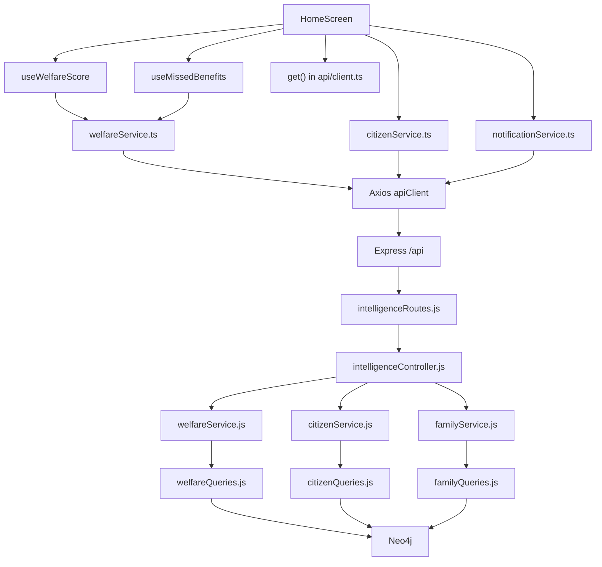

### Roadmap

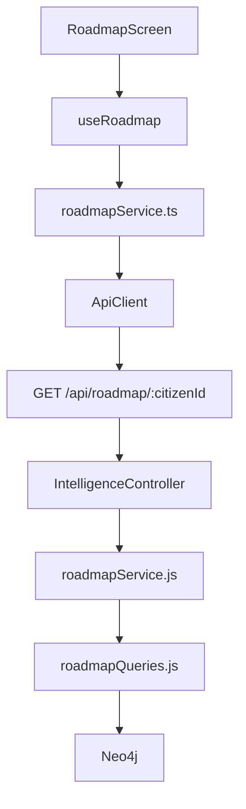

### Assistant

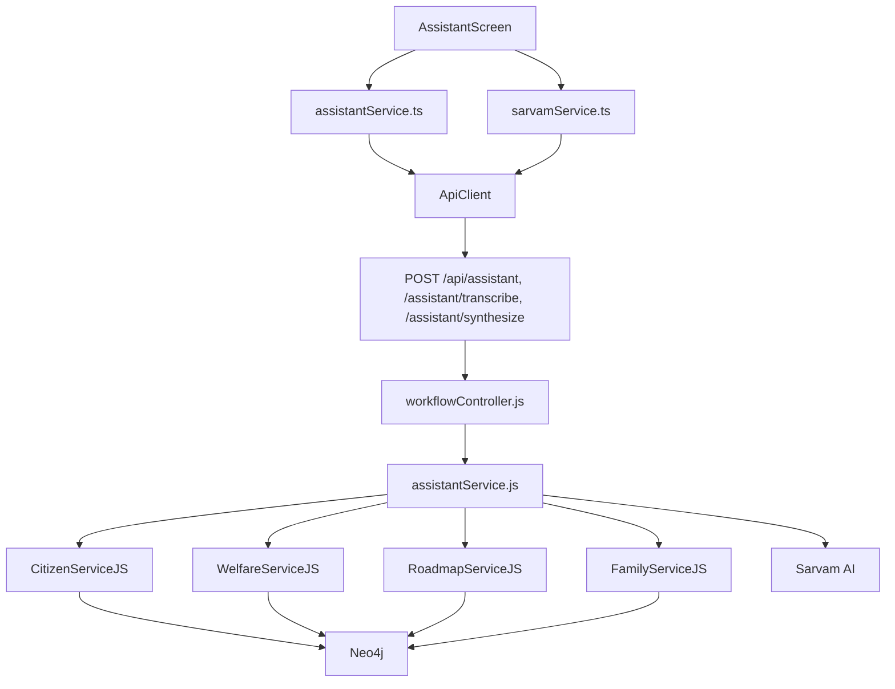

### OCR And Documents

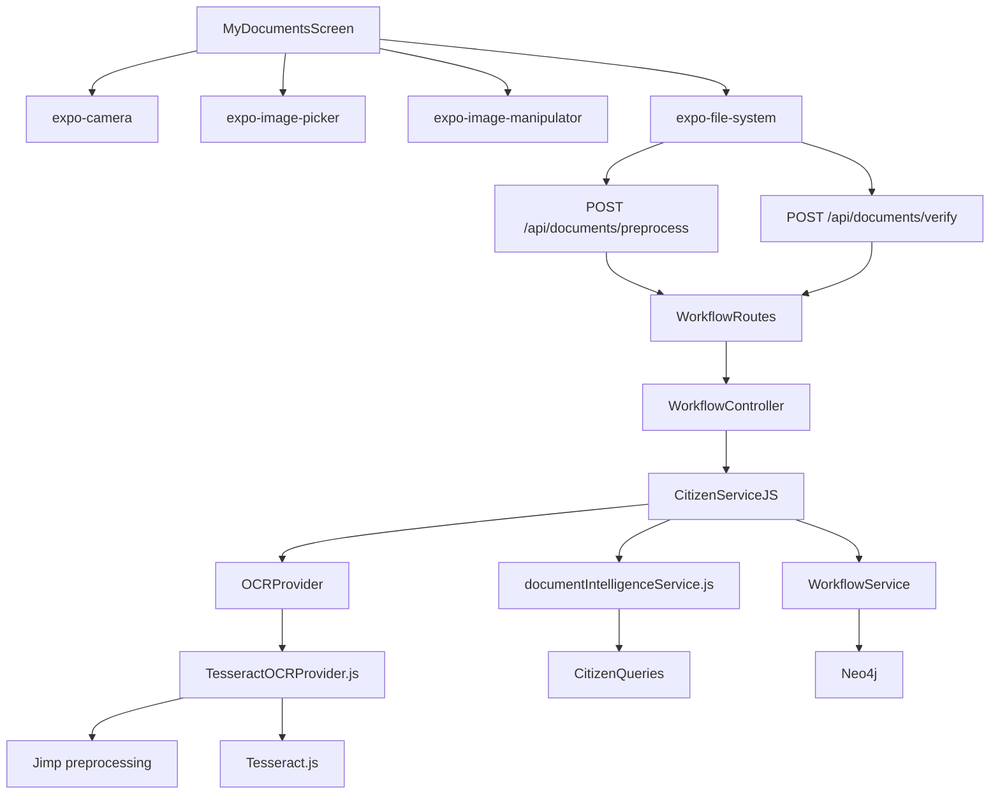

### Authentication

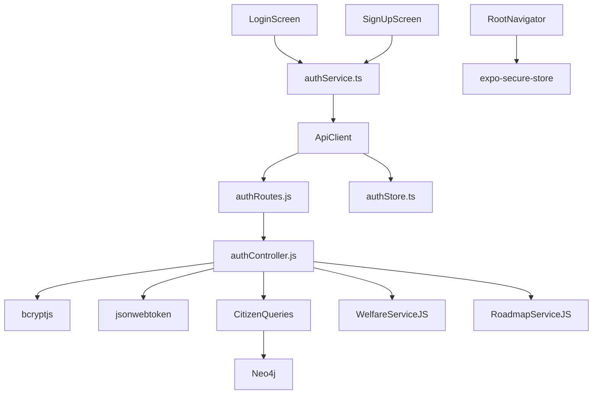

### Profile

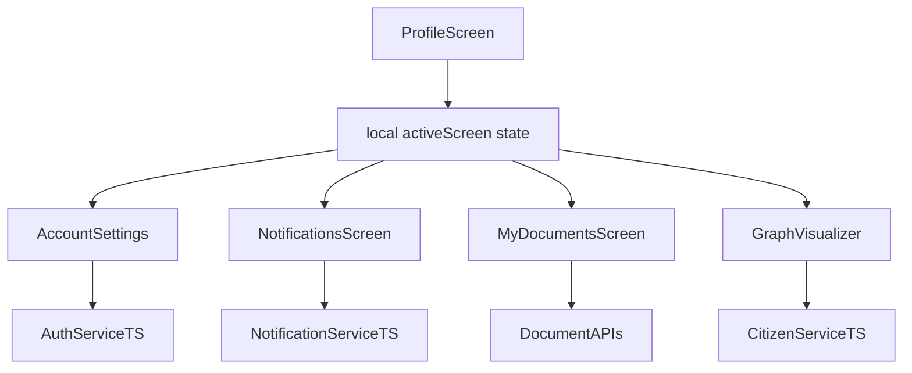

### Notifications

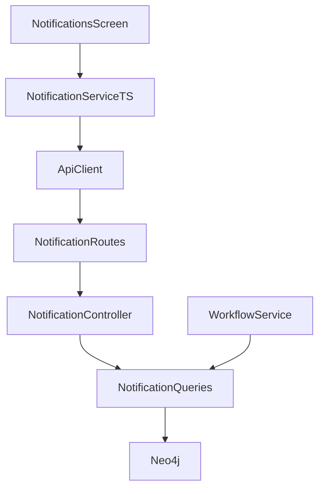

### Graph

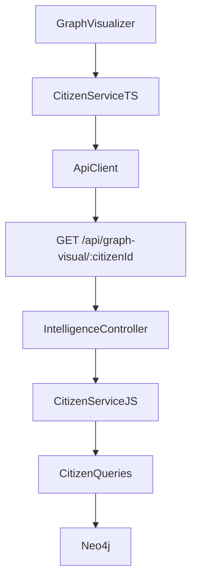

## 4. Backend API Documentation

All protected citizen-specific endpoints require `Authorization: Bearer <jwt>`. `authorizeCitizen` enforces `params.citizenId` or `body.citizenId` matches `req.user.id`; when a body citizen id is absent it injects the authenticated user id.

| Method | Route | Purpose | Auth | Request Body | Response Body | Controller | Service | Query | Frontend Caller | Expected UI | Errors |
| --- | --- | --- | --- | --- | --- | --- | --- | --- | --- | --- | --- |
| `GET` | `/health` | Backend, Neo4j, Sarvam health | No | None | `{status, engine, database, sarvam, environment}` | inline in `app.js` | `db.checkHealth`, Sarvam ping | `RETURN 1` | none | ops/admin health | `503` unhealthy |
| `POST` | `/api/auth/register` | Create citizen account and auto-login | No | `{name,email,password,age?,income?,state?}` | `{user, token, refreshToken}` | `authController.register` | welfare/roadmap refresh after create | `createCitizenAccount`, eligibility/roadmap/recommendation queries | `authService.register`, `SignUpScreen` | signup success, authenticated tabs | `400` missing/invalid/email exists, `500` create failure |
| `POST` | `/api/auth/login` | Login existing citizen | No | `{email,password}` | `{user, token, refreshToken}` | `authController.login` | bcrypt compare, graph sync | `findCitizenByEmail`, `findCitizenByIdSecure`, refresh queries | `authService.login`, `LoginScreen` | authenticated tabs | `400`, `401` |
| `POST` | `/api/auth/logout` | Stateless logout response | No route auth | None | `{success,message}` | `authController.logout` | none | none | `authService.logout`, `authStore.logout` | return to login | none expected |
| `GET` | `/api/auth/me` | Restore current user profile | Yes | None | `{id,name,email,age,income,state,stage}` | `authController.getMe` | welfare recalculation side effect | `findCitizenById`, `recalculateEligibility` | `authService.getMe`, `RootNavigator` | background profile sync | `401`, `404`, `500` |
| `PUT` | `/api/auth/me` | Update authenticated profile fields | Yes | `{name,age?,income?,state?,stage?}` | updated user | `authController.updateProfile` | profile upsert + graph refresh | `findCitizenByIdSecure`, `upsertCitizenProfile`, refresh queries | `authService.updateProfile` | account settings | `400`, `404`, `500` |
| `PUT` | `/api/auth/password` | Change password | Yes | `{oldPassword,newPassword}` | `{success:true}` | `authController.changePassword` | bcrypt compare/hash | `findCitizenByIdSecure`, `updateCitizenPassword` | `authService.changePassword` | privacy/security settings | `400`, `401`, `404` |
| `GET` | `/api/welfare-score/:citizenId` | Current/potential benefit score | Yes + citizen auth | None | `{score,currentBenefits,potentialBenefits}` | `intelligenceController.getWelfareScore` | `welfareService.getWelfareScore` | `welfareQueries.getWelfareScore` | `welfareService.ts`, `useWelfareScore`, `HomeScreen` | score card | `403`, `500` |
| `GET` | `/api/missed-benefits/:citizenId` | Recommended/missed schemes | Yes + citizen auth | None | `{missedSchemes:[...]}` | `intelligenceController.getMissedBenefits` | `welfareService.getMissedBenefits` | `welfareQueries.getMissedBenefits` | `useMissedBenefits`, `HomeScreen` | missed benefits section | `403`, `500` |
| `GET` | `/api/readiness/:citizenId` | Document readiness read model | Yes + citizen auth | None | `{total,readinessPercentage,available,missing}` | `intelligenceController.getDocumentReadiness` | `citizenService.getDocumentReadiness` | `citizenQueries.getDocumentReadiness` | `get('/api/readiness')`, Home/Documents | readiness widgets | `403`, `404`, `500` |
| `GET` | `/api/roadmap/:citizenId` | Current/next life stage roadmap | Yes + citizen auth | None | `{currentStage,nextStage,opportunities}` | `intelligenceController.getRoadmap` | `roadmapService.getRoadmap` | `roadmapQueries.getRoadmap` | `useRoadmap`, `RoadmapScreen` | roadmap cards | `403`, `500` |
| `GET` | `/api/family-optimizer/:citizenId` | Family and household recommendations | Yes + citizen auth | None | `{familyUniverse, householdOptimization}` | `intelligenceController.getFamilyOptimization` | `familyService.getFamilyOptimization` | `familyQueries.*` | `citizenService.getFamilyOptimization`, Home | household bonus widget | `403`, `500` |
| `GET` | `/api/graph-visual/:citizenId` | Graph visualization data | Yes + citizen auth | None | `{citizen, family, stage, state, documents, schemes}` flattened | `intelligenceController.getGraphVisual` | `citizenService.getGraphVisual` | `citizenQueries.getGraphNodesAndRelationships` | `GraphVisualizer` | welfare graph | `403`, `500` |
| `GET` | `/api/similar-citizens/:citizenId` | Similar citizens/peer schemes | Yes + citizen auth | None | `{similar}` | `intelligenceController.getSimilarCitizens` | `citizenService.getSimilarCitizens` | `citizenQueries.findSimilarCitizens` | `citizenService.ts` | advanced profile/graph | `403`, `500` |
| `GET` | `/api/explain-eligibility/:citizenId/:schemeId` | Rule explanation for a scheme | Yes + citizen auth | None | eligibility boolean fields | `intelligenceController.getExplainEligibility` | `welfareService.getExplainEligibility` | `welfareQueries.checkExplainableEligibility` | API service potential future caller | explainability UI | `403`, `500` |
| `GET` | `/api/predictive-eligibility/:citizenId` | Future eligibility opportunities | Yes + citizen auth | None | `{predictions}` | `intelligenceController.getPredictiveEligibility` | `citizenService.getPredictiveEligibility` | `citizenQueries.getPredictiveEligibility` | Home widget, `citizenService.ts` | future pathways | `403`, `500` |
| `POST` | `/api/profile` | Profile workflow update | Yes + citizen auth | `{citizenId?,name,age,income,state,stage,verifyDomicile?}` | `{status,message}` | `workflowController.updateProfile` | `citizenService.updateProfileWorkflow` | `upsertCitizenProfile`, optional doc verify, refresh queries | no direct typed service shown; tests | profile workflow | `400` validation, `403`, `500` |
| `POST` | `/api/assistant` | Text assistant answer | Yes + citizen auth | `{citizenId?,message/question,history?}` | `{answer}` | `workflowController.handleAssistantStream` | `assistantService.generateAssistantResponse` | context queries across citizen/welfare/roadmap/family | `assistantService.ask`, `AssistantScreen` | assistant messages | `403`, `429`, AI fallback, `500` |
| `POST` | `/api/assistant/transcribe` | Speech-to-text relay | Yes + citizen auth | `{audio,languageCode?}` | `{transcript}` | `workflowController.handleTranscribe` | `assistantService.transcribeAudio` | none | `sarvamService.transcribeAudio` | voice input | `400/500`, Sarvam errors |
| `POST` | `/api/assistant/synthesize` | Text-to-speech relay | Yes + citizen auth | `{text,targetLanguageCode?}` | `{audio}` | `workflowController.handleSynthesize` | `assistantService.synthesizeSpeech` | none | `sarvamService.synthesizeSpeech` | voice playback | `400/500`, Sarvam errors |
| `POST` | `/api/documents/preprocess` | Upload image for server-side crop/preprocess | Yes + citizen auth | multipart `file` | `{status,preprocessedImage}` | `workflowController.preprocessDocument` | `citizenService.preprocessDocumentWorkflow` | none | `MyDocumentsScreen.processCapturedImage` | preview processed image | no file, OCR/Jimp failure |
| `POST` | `/api/documents/verify` | Upload and validate document | Yes + citizen auth | multipart `file`, `citizenId`, `documentName`, optional `ocrText`, `ocrConfidence` | `{status,message,document,readiness,notificationsGenerated}` | `workflowController.verifyDocument` | `citizenService.verifyDocumentWorkflow` | `verifyDocumentForCitizen`, workflow queries | `MyDocumentsScreen.handleUploadDocument`, offline sync | success/failure alert, readiness refresh | `400` validation, `403`, `500` |
| `POST` | `/api/workflows/recalculate` | Trigger recalculation workflow | Yes + citizen auth | `{citizenId}` | `{status,citizenId,notificationsGenerated}` | `workflowController.triggerWelfareWorkflow` | `workflowService.runRecalculationWorkflowForCitizen` | welfare, roadmap, notification queries | tests/future admin | background recalculation | `403`, `500` |
| `GET` | `/api/notifications/:citizenId` | List notifications | Yes + citizen auth | None | `{notifications}` | `notificationController.getNotifications` | query module only | `notificationQueries.getNotificationsByCitizen` | `NotificationsScreen` | notification list | `403`, `500` |
| `PUT` | `/api/notifications/read-all/:citizenId` | Mark all notifications read | Yes + citizen auth | None | `{status,message}` | `notificationController.markAllRead` | query module only | `markAllNotificationsRead` | `notificationService.markAllRead` | clear unread state | `403`, `500` |
| `PUT` | `/api/notifications/:notificationId/read` | Mark one notification read | Yes | None | `{status,notification}` | `notificationController.markRead` | query module only | `markNotificationRead` | `notificationService.markAsRead` | item read state | `404`, `500` |
| `DELETE` | `/api/notifications/:notificationId` | Delete notification | Yes | None | `{status,message}` | `notificationController.deleteNotification` | query module only | `deleteNotification` | `notificationService.deleteNotification` | remove item | `404`, `500` |

## 5. Neo4j Database

### Node Types

| Node | Purpose | Key Properties | Owner |
| --- | --- | --- | --- |
| `Citizen` | User/citizen profile and auth identity | `id`, `name`, `email`, `password`, `age`, `income`, `state`, `stage`, timestamps | Auth/Profile |
| `Scheme` | Welfare scheme | `id`, `name`, `financialBenefit`, `minAge`, `maxAge`, `maxIncome` | Welfare data |
| `Document` | Required/supporting document type | `id`, `name` | Document workflow |
| `LifeStage` | Citizen lifecycle stage | `id`, `name` | Roadmap |
| `State` | Indian state or region | `id`, `name` | Eligibility geography |
| `Family` | Household grouping | `id`, `name` | Family optimizer |
| `Notification` | User-visible generated notification | `id`, `type`, `title`, `message`, `read`, `createdAt` | Notifications/workflow |

### Relationships

| Relationship | From | To | Purpose |
| --- | --- | --- | --- |
| `CURRENT_STAGE` | `Citizen` | `LifeStage` | Current life-stage context |
| `RESIDES_IN` | `Citizen` | `State` | Geographic eligibility |
| `HAS_DOCUMENT` | `Citizen` | `Document` | Citizen owns/has verified document |
| `ELIGIBLE_FOR` | `Citizen` | `Scheme` | Derived eligibility relationship |
| `RECOMMENDED_SCHEME` | `Citizen` | `Scheme` | Derived recommendation relationship |
| `BENEFITTING_FROM` | `Citizen` | `Scheme` | Active benefit relationship |
| `REQUIRES_DOCUMENT` | `Scheme` | `Document` | Scheme document requirement |
| `TARGETS_STAGE` | `Scheme` | `LifeStage` | Scheme stage applicability |
| `AVAILABLE_IN` | `Scheme` | `State` | Scheme state applicability |
| `LEADS_TO` | `LifeStage` | `LifeStage` | Roadmap transition |
| `BELONGS_TO` | `Citizen` | `Family` | Household grouping |
| `HAS_NOTIFICATION` | `Citizen` | `Notification` | User notification ownership |

### Constraints And Indexes

Constraints:

- `Citizen.id`
- `Scheme.id`
- `Document.id`
- `LifeStage.id`
- `Family.id`
- `State.id`

Indexes:

- `Citizen.id`
- `Scheme.id`
- `Document.name`
- `LifeStage.name`
- `Family.id`
- `State.id`
- `State.name`

### Graph Dependency

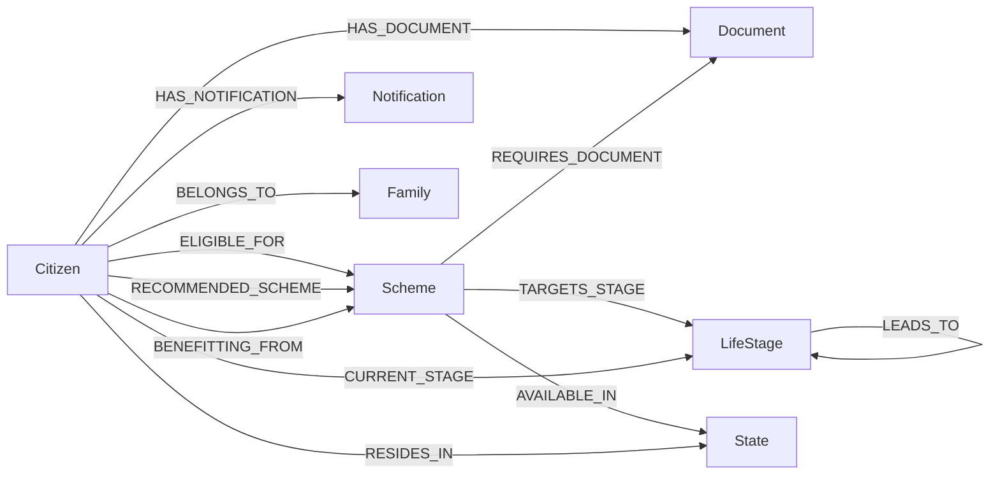

### Example Cypher

Eligibility recalculation:

```cypher
MATCH (c:Citizen {id: $citizenId})
OPTIONAL MATCH (c)-[old:ELIGIBLE_FOR]->(:Scheme)
DELETE old
WITH c
OPTIONAL MATCH (c)-[:CURRENT_STAGE]->(citizenStage:LifeStage)
WITH c, citizenStage
MATCH (s:Scheme)
WHERE c.income <= s.maxIncome
  AND c.age >= s.minAge
  AND c.age <= s.maxAge
  AND (
    NOT EXISTS { MATCH (s)-[:AVAILABLE_IN]->(:State) }
    OR EXISTS { MATCH (s)-[:AVAILABLE_IN]->(:State {name: c.state}) }
  )
MERGE (c)-[:ELIGIBLE_FOR]->(s)
RETURN count(s) as eligibleSchemeCount
```

Document readiness:

```cypher
MATCH (c:Citizen {id:$citizenId})
MATCH (allD:Document)
WITH c, collect(DISTINCT allD) as allDocs
OPTIONAL MATCH (c)-[:HAS_DOCUMENT]->(owned:Document)
WITH c, allDocs, [doc IN collect(DISTINCT owned) WHERE doc IS NOT NULL] AS ownedDocs
OPTIONAL MATCH (c)-[:ELIGIBLE_FOR]->(:Scheme)-[:REQUIRES_DOCUMENT]->(req:Document)
WITH c, allDocs, ownedDocs, [doc IN collect(DISTINCT req) WHERE doc IS NOT NULL] AS schemeReqDocs
WITH CASE WHEN size(schemeReqDocs) > 0 THEN schemeReqDocs ELSE allDocs END AS requiredDocs, ownedDocs
RETURN {
  total:size(requiredDocs),
  available:[d IN requiredDocs WHERE d IN ownedDocs | d.name],
  missing:[d IN requiredDocs WHERE NOT d IN ownedDocs | d.name]
} AS readiness
```

### Source Of Truth

Neo4j is the source of truth for citizen profile attributes, document relationships, scheme eligibility relationships, roadmap relationships, notifications, and assistant context. Frontend state is a cached/presentational projection. `AsyncStorage` and `SecureStore` are local client persistence layers, not authoritative data stores.

## 6. State Management

| Store | Purpose | State | Actions | Updated By | Read By | Persistence | Sync Lifecycle |
| --- | --- | --- | --- | --- | --- | --- | --- |
| `authStore` | Authenticated user/session | `user`, `isAuthenticated`, `isLoading`, `token` | `setUser`, `setToken`, `logout`, `setLoading` | login/signup/root restore/API `401` | RootNavigator, screens, API client | `expo-secure-store` | Root restores token/user; API client logs out on `401` |
| `networkStore` | Offline indicator | `isOffline` | `setIsOffline` | API wrapper network failures/success | Home, Documents | none | `get/post/put/patch/del` mark offline or online |
| `appStore` | App UI preferences | `theme`, `isOnboarded`, `isSidebarOpen` | theme/onboarding/sidebar setters | UI components | future UI | none | not connected to backend |
| `welfareStore` | Optional global welfare cache | score fields, missed schemes, loading/error | setters/reset | currently not central in visible screens | future consumers | none | screen hooks currently own live fetch state |
| `roadmapStore` | Optional roadmap phase cache | phases, loading/error | phase setters | currently not central in `RoadmapScreen` | future consumers | none | `useRoadmap` currently owns live fetch state |

Important architectural note: the stable screens mostly use local hook state rather than global welfare/roadmap stores. That is acceptable for v25 stability and should not be disturbed casually. Future synchronization work should decide whether stores become true read-model caches or remain unused scaffolding.

## 7. OCR Architecture

### End-To-End OCR Pipeline

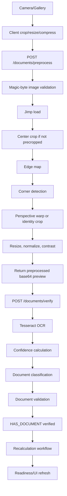

### Stage Details

| Stage | Input | Output | Files/Functions | Dependencies | Failure Cases | Recovery |
| --- | --- | --- | --- | --- | --- | --- |
| Camera | user camera permission + image | local URI | `CameraView`, `handleCapturePhoto` | `expo-camera` | denied permission, capture failure | alert user, retry |
| Gallery | user-selected image | local URI | `ImagePicker.launchImageLibraryAsync` | `expo-image-picker` | canceled selection, gallery error | no-op/alert |
| Client compression | URI, dimensions | compressed/cropped file URI | `manipulateAsync`, `File` | `expo-image-manipulator`, `expo-file-system` | file missing, manipulation error | alert/queue offline |
| Upload preprocessing | multipart file | preprocessed base64 JPEG | `/api/documents/preprocess`, `preprocessDocumentWorkflow` | multer, OCRProvider | backend unreachable, no file, Jimp error | alert, local fallback/queue |
| Header validation | file path | boolean | `isValidImageHeader` | fs | invalid image bytes | return empty OCR result |
| Crop/corners/warp | Jimp image | normalized image | `preprocessPipeline` | Jimp | poor lighting, bad crop, no corners | fallback to full image or identity crop |
| OCR | processed image path | `{text, confidence}` | `extractText`, Tesseract worker | `tesseract.js` | unreadable image, worker error | return empty text/confidence 0 |
| Classification | OCR text + document name | best matching document | `scoreRule`, `canonicalizeDocumentName` | regex/rule table | wrong document, low confidence | 400 with reason |
| Validation | file + text + confidence | valid/invalid result | `validateUploadedDocument` | document rules | unsupported type, low confidence | meaningful rejection |
| Neo4j update | citizen id + canonical doc | verified relationship | `verifyDocumentForCitizen` | Neo4j | DB failure | global error handler |
| Workflow trigger | citizen id | recalculation result | `runRecalculationWorkflowForCitizen` | welfare/roadmap/notification queries | workflow failure | request fails; future work should isolate |
| UI refresh | API response | refreshed readiness | `fetchReadiness` | frontend API | network failure | alert/offline queue |

## 8. Sarvam AI Architecture

### Flow

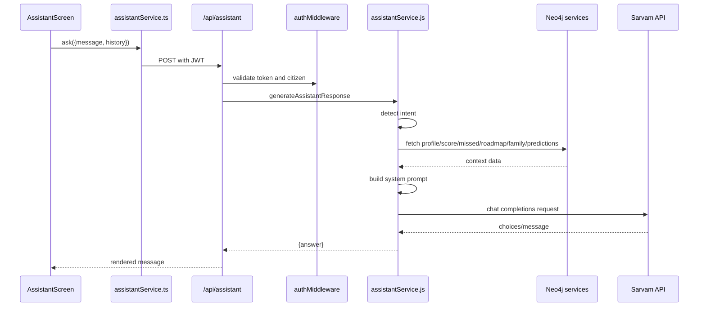

### Prompt Generation

Prompt generation is currently inline in `assistantService.generateAssistantResponse`. It builds a `contextString` from Neo4j-derived data, then inserts it into a system prompt that instructs the assistant to answer only from graph context. This design keeps the frontend simple but creates a future need for a dedicated prompt-builder module.

### Conversation History

The backend accepts `history`, filters it to user/assistant roles, trims to the last eight messages, and truncates each content value to 1200 characters. The filtered history is sent between the system prompt and current user message.

### Context Injection

Keyword-based intent detection selects context sections:

- welfare score
- missed benefits
- roadmap
- family optimizer
- predictive eligibility

If no intent is detected, welfare score and missed benefits are fetched by default.

### Error Handling, Retries, Timeouts, Logging

- Chat completion retries up to three attempts with simple backoff.
- Chat completion timeout is 35 seconds.
- STT/TTS retry up to three attempts.
- Logs include request URL/model/query length, duration, HTTP status, and completion metadata.
- Missing Sarvam key returns a user-facing unavailable message for chat and throws for STT/TTS.
- Unexpected AI failures return graceful generic answers in some paths and throw in others.

## 9. Document Workflow

Current production flow:

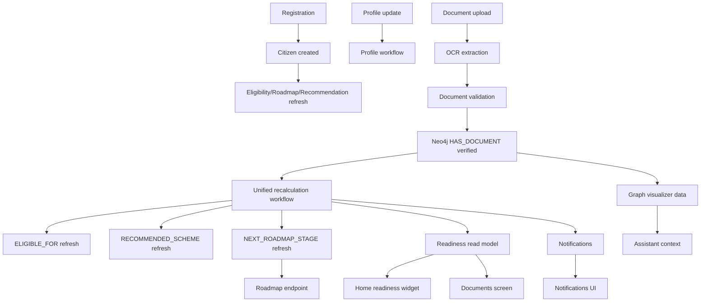

Important caveat: the requested future registration flow requires explicit required documents for every new citizen. The current implementation creates the citizen and triggers calculations, but does not yet create Aadhaar/PAN/Income Certificate as missing/not verified required document relationships.

## 10. Data Ownership By Screen

| Screen | Data Origin | Calculated By | Owner | Updated By | Consumed By | Refreshed By | Source Of Truth |
| --- | --- | --- | --- | --- | --- | --- | --- |
| Login | user input + auth API | backend auth | Auth subsystem | user submit | `RootNavigator`, `authStore` | login action | Neo4j Citizen + JWT |
| SignUp | user input + register API | backend auth | Auth subsystem | user submit | `RootNavigator`, `authStore` | register action | Neo4j Citizen |
| Home | welfare/missed/readiness/family/predictions/notifications APIs | backend services/queries | Backend read models | workflow/profile/document changes | dashboard widgets | focus effect + hooks | Neo4j |
| Roadmap | roadmap API | `roadmapQueries` | Roadmap subsystem | workflow refresh | Roadmap screen | focus effect | Neo4j life-stage graph |
| Assistant | user messages + assistant API | backend assistant + Sarvam | Assistant subsystem | user prompts | Assistant UI | per message | Neo4j context + Sarvam response |
| Profile | `authStore.user` | auth/backend profile | Auth/Profile | auth restore/update | Profile shell | secure restore/getMe | Neo4j + SecureStore cache |
| Account Settings | auth user/profile | backend auth update | Auth/Profile | update profile | Account UI | submit/getMe | Neo4j |
| My Documents | readiness API + local queue | backend readiness + local queue | Document subsystem | upload/verify/offline queue | Documents UI | mount, pull refresh, upload success | Neo4j + local queue |
| Notifications | notifications API | notification queries/workflow | Notification subsystem | workflow/mark read/delete | Notifications UI/Home unread flag | screen fetch/Home focus fetch | Neo4j |
| Graph Visualizer | graph visual API | citizen graph query | Graph subsystem | any graph mutation | Graph UI | screen fetch | Neo4j |

## 11. Source Of Truth Analysis

### Single Source Areas

- Auth identity: Neo4j `Citizen`; frontend SecureStore is a session cache.
- Welfare score: Neo4j-derived query.
- Roadmap: Neo4j life-stage relationships.
- Notifications: Neo4j `Notification` nodes.
- Graph visualizer: Neo4j relationship projection.

### Multiple Or Duplicated Sources

| Area | Duplication | Risk |
| --- | --- | --- |
| Citizen stage | Stored as `c.stage` and `CURRENT_STAGE` relationship | mismatch between property and relationship |
| Citizen state | Stored as `c.state` and `RESIDES_IN` relationship | geography eligibility inconsistencies |
| Readiness | Backend computes required docs; frontend unions missing docs with a hardcoded standard list | UI may show docs not required by backend |
| Eligibility refresh | Triggered in register, login, getMe, profile update, document workflow, workflow endpoint | mutation during session restore; duplicate work |
| Notifications | Workflow creates notifications without clear idempotency key | repeated recalculations may duplicate messages |
| Upload state | Server stores uploaded file; client stores offline queue file | no single lifecycle/retention model |

## 12. Security

| Concern | Current Design | Risks | Recommended Direction |
| --- | --- | --- | --- |
| Authentication | JWT signed with `JWT_SECRET` | expiry hardcoded to 24h; no refresh rotation | central auth config, real refresh/session model |
| Password hashing | bcryptjs hash/compare | acceptable baseline | keep, tune cost as needed |
| Client token storage | `expo-secure-store` | device compromise still possible | keep; add logout/session invalidation later |
| Authorization | `authorizeCitizen` checks route/body citizen id | notification id routes do not verify ownership directly | ownership checks for object-id routes |
| Upload validation | multer accepts file, document intelligence checks mimetype | mimetype can be spoofed; local disk retention | magic-byte validation at upload boundary, size limits, cleanup |
| OCR validation | confidence + rules | no authenticity verification | field extraction, tamper checks, document-specific validators |
| Rate limiting | in-memory per route/IP | not distributed, resets on process restart | Redis/external limiter for production |
| CORS | allow-list from env or dev/test bypass | env naming mismatch with `.env.example` (`CORS_ORIGIN` vs `ALLOWED_ORIGINS`) | one documented CORS variable |
| Env/secrets | `.env.example` documents secrets | tests contain concrete-looking Neo4j env values | scrub test secrets; central secret policy |
| Sarvam keys | backend only | health check pings external API | keep server-side; document rate/cost impact |

## 13. Performance

### Network Bottlenecks

- Home performs multiple independent calls on focus: welfare score, missed benefits, family optimizer, predictive eligibility, readiness, notifications.
- Login and session restore can trigger backend recalculations.
- Assistant can call several backend graph services before Sarvam.

### Rendering And Request Risks

- `HomeScreen` and `RoadmapScreen` are stable but sensitive to focus-effect and hook dependency changes.
- Any future data consolidation must preserve current render cadence and avoid request loops.

### Expensive Backend Work

- OCR preprocessing and Tesseract recognition are CPU-heavy and synchronous in request flow.
- Neo4j eligibility queries scan candidate schemes and relationship patterns.
- Sarvam calls can take up to 35 seconds.
- Workflow recalculation can produce multiple queries and notification writes.

### Potential Optimizations

- Backend dashboard aggregate endpoint to reduce Home request fan-out, after contract design and careful UI regression testing.
- Queue OCR in a worker for large files or production scale.
- Add upload size limits before Jimp/Tesseract.
- Add Neo4j query profiling and indexes for high-cardinality properties.
- Introduce idempotent workflow runs and notification dedupe.
- Use structured caching for read models, not ad hoc frontend-only caching.

## 14. Technical Debt And High-Risk Areas

| Area | Debt | Risk |
| --- | --- | --- |
| Stable UI | Focus/render/request logic is fragile but stable | accidental flicker/request storm |
| Workflow | Multiple mutation entrypoints | inconsistent recalculation state |
| Documents | Required vs available vs verified not fully modeled | readiness mismatch |
| OCR | debug artifacts tracked, local disk output | repository noise, storage growth |
| Assistant | keyword intent and inline prompt builder | brittle responses, hard testing |
| Auth | dummy refresh token | production security gap |
| Tests | query string mocking | false positives/fragility |
| Rate limiting | in-memory | multi-instance inconsistency |
| Env config | variables split across app/backend docs | deploy mistakes |
| Notifications | no idempotency | duplicate alerts |

## 15. Engineering Roadmap

| Phase | Why This Order | Dependencies | Expected Outcome | Regression Risks |
| --- | --- | --- | --- | --- |
| 1. Architecture | Establish shared map before code | current code review | this document | none |
| 2. OCR improvements | Document upload is a core blocker and mostly backend-contained | current OCR path, fixtures | reliable extraction/classification | CPU load, upload UX |
| 3. Document verification workflow | OCR needs a clean state transition target | OCR, Neo4j model | one document lifecycle | readiness/UI mismatch |
| 4. Unified workflow engine | All mutations should trigger one path | document workflow, eligibility queries | consistent recalculation | duplicate notifications if not idempotent |
| 5. New user initialization | Needs document model/workflow clarity first | document states | required docs visible immediately | auth/register behavior changes |
| 6. Sarvam AI | Assistant quality depends on clean graph context | unified data model | grounded assistant responses | latency, API errors |
| 7. Synchronization/read models | After backend truth is stable, optimize API fan-out | workflow/idempotency | fewer calls, stable refreshes | Home/Roadmap regressions |
| 8. Notifications hardening | Depends on workflow events | workflow idempotency | reliable alerting | duplicated/missing alerts |
| 9. Performance and scale | Optimize proven flows | metrics/profiling | lower latency/cost | premature changes to stable behavior |
| 10. Testing and APK readiness | Final validation before release | stable subsystems | shippable app | build/env issues |

## 16. Appendices

### File Ownership Matrix

| File/Folder | Owner | Notes |
| --- | --- | --- |
| `App.tsx` | Frontend platform | Stable app shell; avoid changes |
| `src/navigation/RootNavigator.tsx` | Frontend platform/auth | Stable auth restoration/navigation; avoid changes |
| `src/screens/HomeScreen.tsx` | Dashboard owner | Stable and protected |
| `src/screens/RoadmapScreen.tsx` | Roadmap owner | Stable and protected |
| `src/screens/AssistantScreen.tsx` | Assistant frontend | Message UI and voice controls |
| `src/screens/ProfileScreen.tsx` | Profile frontend | Local sub-screen routing |
| `src/screens/profile/MyDocumentsScreen.tsx` | Document frontend | Camera/gallery/upload/offline queue |
| `src/lib/api/client.ts` | Client API owner | Token, offline cache, network state |
| `src/lib/api/services/*` | API contract owner | Typed endpoint wrappers |
| `src/hooks/*` | Frontend data owner | Stable fetch cadence |
| `src/store/*` | State owner | Zustand global state |
| `benefitos-backend/src/app.js` | Backend platform | Express composition |
| `benefitos-backend/src/routes/*` | API owner | Endpoint/middleware declarations |
| `benefitos-backend/src/controllers/*` | API owner | HTTP adapters |
| `benefitos-backend/src/services/citizenService.js` | Citizen/document owner | Broad service; future split recommended |
| `benefitos-backend/src/services/workflowService.js` | Workflow owner | Recalculation orchestration |
| `benefitos-backend/src/services/assistantService.js` | Assistant backend | Sarvam + context |
| `benefitos-backend/src/services/ocr/*` | OCR owner | Tesseract/Jimp provider |
| `benefitos-backend/src/queries/*` | Data platform | Cypher source |
| `benefitos-backend/src/middleware/*` | Backend platform/security | Auth/rate/errors/validation |
| `benefitos-backend/database/*` | Data platform | Neo4j schema hardening |
| `benefitos-backend/tests/api.test.js` | Test owner | Backend integration-ish tests with mocks |

### Important Configuration Files

| File | Purpose |
| --- | --- |
| `package.json` | Expo app dependencies and scripts |
| `app.json` | Expo app metadata, permissions, plugins, EAS project id |
| `tsconfig.json` | TypeScript config and path aliases |
| `babel.config.js` | Babel/Expo config |
| `metro.config.js` | Metro bundler config |
| `tailwind.config.js` | NativeWind/Tailwind config |
| `eslint.config.js` | ESLint configuration |
| `benefitos-backend/package.json` | Backend dependencies and scripts |
| `benefitos-backend/.env.example` | Backend env template |
| `benefitos-backend/database/*.cypher` | Neo4j constraints/indexes |

### Environment Variables

| Variable | Side | Purpose |
| --- | --- | --- |
| `EXPO_PUBLIC_API_BASE_URL` | Frontend | Base URL for Axios and file uploads |
| `EXPO_PUBLIC_API_URL` | Frontend | Present in env export; confirm usage before relying on it |
| `NODE_ENV` | Backend | Runtime mode; disables rate limiting and external health behavior in tests |
| `PORT` | Backend | Express listen port |
| `NEO4J_URI` | Backend | Neo4j connection URI |
| `NEO4J_USER` | Backend | Neo4j username |
| `NEO4J_PASSWORD` | Backend | Neo4j password |
| `JWT_SECRET` | Backend | JWT signing secret |
| `JWT_EXPIRES_IN` | Backend | Documented but not currently wired into signing |
| `SARVAM_API_KEY` | Backend | Sarvam API subscription key |
| `SARVAM_MODEL` | Backend | Chat completion model override |
| `SARVAM_MAX_TOKENS` | Backend | Chat max token override |
| `SARVAM_TTS_MAX_CHARS` | Backend | TTS text truncation length |
| `ALLOWED_ORIGINS` | Backend | Actual CORS allow-list used by app |
| `CORS_ORIGIN` | Backend | Documented in example but not used by `app.js` |
| `RENDER_API_KEY`, `RENDER_SERVICE_ID`, `RENDER_WORKFLOW_ID` | Backend | Render workflow/service integration placeholders |

### Dependency List

Frontend:

- Expo SDK 56 packages: camera, file-system, image-manipulator, image-picker, secure-store, audio, splash-screen, status-bar, constants, dev-client.
- React 19.2.3 and React Native 0.85.3.
- React Navigation bottom tabs/native.
- Zustand.
- Axios.
- NativeWind/Tailwind.

Backend:

- Express.
- CORS.
- dotenv.
- bcryptjs.
- jsonwebtoken.
- neo4j-driver.
- multer.
- jimp.
- tesseract.js.

Third-party services:

- Neo4j AuraDB or local Neo4j.
- Sarvam AI chat, speech-to-text, and text-to-speech.
- Expo/EAS build tooling.

### Build Process

Frontend development:

```bash
npm install
npx expo start
npm run lint
npx tsc --noEmit
npx expo-doctor
```

Backend development:

```bash
cd benefitos-backend
npm install
npm run dev
npm test
```

Neo4j schema setup:

```bash
cypher-shell -a "$NEO4J_URI" -u "$NEO4J_USER" -p "$NEO4J_PASSWORD" -f database/constraints.cypher
cypher-shell -a "$NEO4J_URI" -u "$NEO4J_USER" -p "$NEO4J_PASSWORD" -f database/indexes.cypher
```

### Deployment Flow

Current deployment flow is not fully codified. Expected production flow:

1. Configure backend env secrets.
2. Apply Neo4j constraints and indexes.
3. Deploy backend service.
4. Verify `/health`.
5. Configure frontend `EXPO_PUBLIC_API_BASE_URL`.
6. Build app through Expo/EAS.
7. Run manual smoke tests for login, Home, Roadmap, document upload, assistant, notifications, and logout.

### Testing Strategy

Current tests:

- Backend API tests in `benefitos-backend/tests/api.test.js`.
- Tests mock Neo4j by intercepting `config/db`.
- Sarvam calls are mocked by overriding global fetch.
- Coverage includes health, welfare, missed benefits, readiness, document verify/preprocess, profile, assistant, auth, graph, workflow, and notifications.

Required future test layers:

- Frontend API contract tests.
- OCR fixture tests with real mock document images.
- Neo4j integration tests against a test database.
- Workflow idempotency tests.
- Notification dedupe tests.
- Auth/session security tests.
- Manual regression checklist for Home, Roadmap, navigation, focus lifecycle, and request loop detection.
